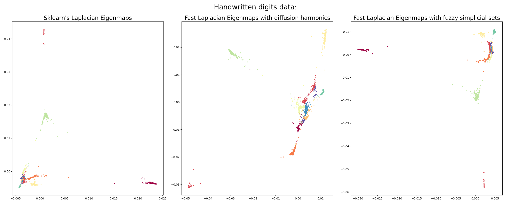
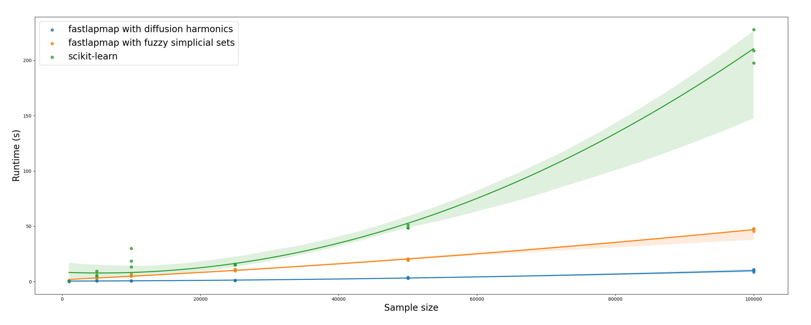

[](https://pypi.org/project/fastlapmap/)
[](https://opensource.org/licenses/MIT)
[](https://twitter.com/davisidarta)
        
# Fast Laplacian Eigenmaps in python

Open-source [Laplacian Eigenmaps](https://www2.imm.dtu.dk/projects/manifold/Papers/Laplacian.pdf) for dimensionality reduction of large data in python. Comes with an
 wrapper for [NMSlib](https://github.com/nmslib/nmslib) to compute approximate-nearest-neighbors.
Performs several times faster than the default [scikit-learn implementation](https://scikit-learn.org/stable/modules/generated/sklearn.manifold.SpectralEmbedding.html).    
        
# Installation

You'll need NMSlib for using this package properly. Installing it with no binaries is recommended if your CPU supports
 advanced instructions (it problably does): 
```
pip3 install --no-binary :all: nmslib
```
Along with requirements:
```
pip3 install numpy pandas scipy scikit-learn 
```
Then you can install this package with pip:
```
pip3 install fastlapmap
```


# Usage 

See the following example with the [handwritten digits data](https://archive.ics.uci.edu/ml/datasets/Optical+Recognition+of+Handwritten+Digits).
Here, I visually compare results from the scikit-learn Laplacian Eigenmaps 
[implementation](https://scikit-learn.org/stable/modules/generated/sklearn.manifold.SpectralEmbedding.html#sklearn.manifold.SpectralEmbedding) to 
those from my implementation.

Note that this implementation contains two similarity-learning algorithms: [anisotropic diffusion maps](https://doi.org/10.1073/pnas.0500334102) and [fuzzy simplicial sets](https://arxiv.org/abs/1802.03426).


```
# Import libraries
import numpy as np
import matplotlib.pyplot as plt
from sklearn.manifold import SpectralEmbedding
from fastlapmap import LapEigenmap

# Load some data
from sklearn.datasets import load_digits
digits = load_digits()
data = digits.data

# Define hyperparameters
N_EIGS=2
N_NEIGHBORS=10
N_JOBS=10

sk_se = SpectralEmbedding(n_components=N_EIGS, n_neighbors=N_NEIGHBORS, n_jobs=N_JOBS).fit_transform(data)

flapmap_diff = LapEigenmap(data, n_eigs=2, similarity='diffusion', norm_laplacian=True, k=N_NEIGHBORS, n_jobs=N_JOBS)
flapmap_fuzzy = LapEigenmap(data, n_eigs=2, similarity='fuzzy', norm_laplacian=True, k=N_NEIGHBORS, n_jobs=N_JOBS)

fig, (ax1, ax2, ax3) = plt.subplots(1, 3)
fig.suptitle('Handwritten digits data:', fontsize=24)
ax1.scatter(sk_se[:, 0], sk_se[:, 1], c=digits.target, cmap='Spectral', s=5)
ax1.set_title('Sklearn\'s Laplacian Eigenmaps', fontsize=20)
ax2.scatter(flapmap_diff[:, 0], flapmap_diff[:, 1], c=digits.target, cmap='Spectral', s=5)
ax2.set_title('Fast Laplacian Eigenmaps with diffusion harmonics', fontsize=20)
ax3.scatter(flapmap_fuzzy[:, 0], flapmap_fuzzy[:, 1], c=digits.target, cmap='Spectral', s=5)
ax3.set_title('Fast Laplacian Eigenmaps with fuzzy simplicial sets', fontsize=20)
plt.show()
```


As we can see, results are nearly identical. Qualitatively, fastlapmap embeddings seem to better
separate distinct digits than the default
[scikit-learn implementation](https://scikit-learn.org/stable/modules/generated/sklearn.manifold.spectral_embedding.html).

# Parameters

`data` : numpy.ndarray, pandas.DataFrame or scipy.sparse.csr_matrix Input data. By default will use nmslib for
    approximate nearest-neighbors, which works both on numpy arrays and sparse matrices (faster and cheaper option).
     Alternatively, users can provide a precomputed affinity matrix by stating `metric='precomputed'`.

`n_eigs` : int (optional, default 10).
     Number of eigenvectors to decompose the graph Laplacian into.

`k` : int (optional, default 10).
        Number of k-nearest-neighbors to use when computing affinities.

`metric` : str (optional, default 'euclidean').
        which metric to use when computing neighborhood distances. Defaults to 'euclidean'.
        Accepted metrics include:
        -'sqeuclidean'
        -'euclidean'
        -'l1'
        -'lp' - requires setting the parameter `p` - equivalent to minkowski distance
        -'cosine'
        -'angular'
        -'negdotprod'
        -'levenshtein'
        -'hamming'
        -'jaccard'
        -'jansen-shan'

`M` : int (optional, default 10).
        defines the maximum number of neighbors in the zero and above-zero layers during HSNW
        (Hierarchical Navigable Small World Graph). However, the actual default maximum number
        of neighbors for the zero layer is 2*M.  A reasonable range for this parameter
        is 5-100. For more information on HSNW, please check https://arxiv.org/abs/1603.09320.
        HSNW is implemented in python via NMSlib. Please check more about NMSlib at https://github.com/nmslib/nmslib.

`efC` : int (optional, default 20).
        A 'hnsw' parameter. Increasing this value improves the quality of a constructed graph
        and leads to higher accuracy of search. However this also leads to longer indexing times.
        A reasonable range for this parameter is 10-500.

`efS` : int (optional, default 100).
        A 'hnsw' parameter. Similarly to efC, increasing this value improves recall at the
        expense of longer retrieval time. A reasonable range for this parameter is 10-500.

`n_jobs` : int (optional, default 1)
        How many threads to use in approximate-nearest-neighbors computation.

`similarity` : str (optional, default 'diffusion').
        Which algorithm to use for similarity learning. Options are diffusion harmonics ('diffusion')
        , fuzzy simplicial sets ('fuzzy') and continuous k-nearest-neighbors ('cknn').

`norm_laplacian` : bool (optional, default True).
        Whether to renormalize the graph Laplacian.

`return_evals` : bool (optional, default False).
        Whether to also return the eigenvalues in a tuple of eigenvectors, eigenvalues. Defaults to False.

`verbose` : bool (optional, default False).
        Whether to report information on the current progress of the algorithm.


# Benchmark

See the runtime comparison between this implementation and scikit-learn:

```
## Load benchmark function:
from fastlapmap.benchmark import runtime_benchmark

# Load data
from sklearn.datasets import load_digits
digits = load_digits()
data = digits.data

# Define hyperparameters
N_EIGS = 2
N_NEIGHBORS = 10
N_JOBS = 10
SIZES = [1000, 5000, 10000, 25000, 50000, 100000]
N_RUNS = 3

runtime_benchmark(data,
                  n_eigs=N_EIGS,
                  n_neighbors=N_NEIGHBORS,
                  n_jobs=N_JOBS,
                  sizes=SIZES,
                  n_runs=N_RUNS)
```



As you can see, the diffusion harmoics model is the fastest, followed closely by fuzzy simplicial sets. Both outperform 
scikit-learn default implementation and escalate linearly with sample size.


# License
MIT License
2021, Davi Sidarta-Oliveira
