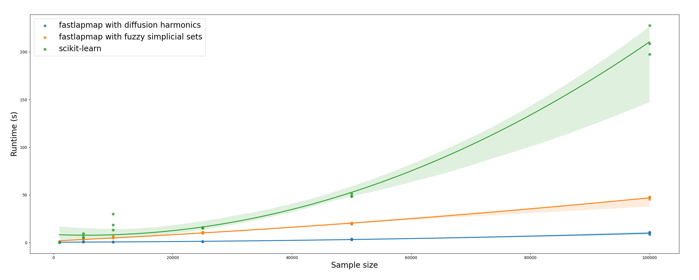

# Benchmark

See the runtime comparison between this implementation and scikit-learn:

```
## Load benchmark function:
from fastlapmap.benchmark import runtime_benchmark

# Load data
from sklearn.datasets import load_digits
digits = load_digits()
data = digits.data

# Define hyperparameters
N_EIGS = 2
N_NEIGHBORS = 10
N_JOBS = 10
SIZES = [1000, 5000, 10000, 25000, 50000, 100000]
N_RUNS = 3

runtime_benchmark(data,
                  n_eigs=N_EIGS,
                  n_neighbors=N_NEIGHBORS,
                  n_jobs=N_JOBS,
                  sizes=SIZES,
                  n_runs=N_RUNS)
```



As you can see, the diffusion harmoics model is the fastest, followed closely by fuzzy simplicial sets. Both outperform 
scikit-learn default implementation and escalate linearly with sample size.